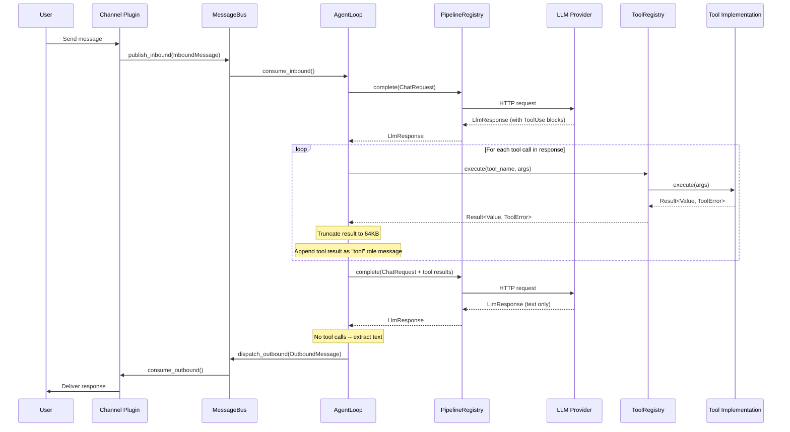

# Tool Call Lifecycle

This guide explains how tool calls work end-to-end: from the LLM emitting a
tool-use request, through execution and result capture, back into the LLM for
the next turn.

---

## Overview

When the LLM responds with a `tool_call` instead of text, the `AgentLoop`
executes the requested tool and feeds the result back to the LLM as a new
message. This continues in a loop until the LLM responds with plain text (no
more tool calls) or `max_tool_iterations` is reached.

The key components involved are:

- **AgentLoop** -- drives the loop, extracting tool calls from LLM responses
- **ToolRegistry** -- maps tool names to implementations and dispatches execution
- **PipelineRegistry** -- sends the updated conversation (with tool results) back to the LLM
- **Security layer** -- truncates tool output to prevent context overflow

---

## The Tool Call Loop

The loop is implemented in `AgentLoop::run_tool_loop`. Each iteration follows
these steps:

1. **Send ChatRequest to LLM** via the pipeline (`PipelineRegistry::complete`).
2. **Parse the response** for `ContentBlock::ToolUse` blocks.
3. **If no tool calls are found**, extract the text content blocks, join them,
   and return the final text response. The loop is done.
4. **For each tool call**:
   a. Look up the tool by name in the `ToolRegistry`.
   b. Execute the tool with the provided JSON arguments.
   c. On success, keep the prompt body at 64 KB (`MAX_TOOL_RESULT_BYTES = 65,536`). Large results are archived next to the session JSONL and projected (head/tail + `obs_recall` handle); the tail is not discarded. Archive failure falls back to `truncate_result`.
   d. On error, produce a JSON error object (`{"error": "..."}`).
   e. Append the tool result as a `"tool"` role message to the conversation,
      tagged with the matching `tool_call_id`.
5. **Loop back to step 1** with the updated messages array.
6. **If `max_tool_iterations` is reached** without the LLM producing a text-only
   response, return a `ClawftError::Provider` error.

```rust
// Simplified from AgentLoop::run_tool_loop
async fn run_tool_loop(&self, mut request: ChatRequest) -> Result<String> {
    let max_iterations = self.config.defaults.max_tool_iterations.max(1) as usize;

    for iteration in 0..max_iterations {
        let response = self.pipeline.complete(&request).await?;

        let tool_calls: Vec<_> = response.content.iter()
            .filter_map(|block| match block {
                ContentBlock::ToolUse { id, name, input } =>
                    Some((id.clone(), name.clone(), input.clone())),
                _ => None,
            })
            .collect();

        if tool_calls.is_empty() {
            // Extract and return the text response
            return Ok(extract_text(&response));
        }

        for (id, name, input) in tool_calls {
            let result = self.tools.execute(&name, input).await;
            let result_json = match result {
                Ok(val) => {
                    let truncated = truncate_result(val, MAX_TOOL_RESULT_BYTES);
                    serde_json::to_string(&truncated).unwrap_or_default()
                }
                Err(e) => format!("{{\"error\": \"{}\"}}", e),
            };

            request.messages.push(LlmMessage {
                role: "tool".into(),
                content: result_json,
                tool_call_id: Some(id),
            });
        }
    }

    Err(ClawftError::Provider {
        message: format!("max tool iterations ({}) exceeded", max_iterations),
    })
}
```

### Sequence Diagram



---

## Tool Schema Format

Tools are presented to the LLM as JSON Schema objects in the `tools` field of
the `ChatRequest`. The `ToolRegistry::schemas()` method generates these from all
registered tools, sorted alphabetically by name:

```json
{
  "type": "function",
  "function": {
    "name": "read_file",
    "description": "Read the contents of a file",
    "parameters": {
      "type": "object",
      "properties": {
        "path": {
          "type": "string",
          "description": "File path to read"
        }
      },
      "required": ["path"]
    }
  }
}
```

Each tool's `parameters()` method returns the JSON Schema object describing its
accepted arguments. The registry wraps this in the `function` envelope that
OpenAI-compatible APIs expect.

### Tool Call Message Format

When the LLM decides to invoke a tool, its response contains `ToolUse` content
blocks:

```json
{
  "role": "assistant",
  "content": [
    {
      "type": "tool_use",
      "id": "call_abc123",
      "name": "read_file",
      "input": { "path": "src/main.rs" }
    }
  ]
}
```

After execution, the tool result is appended as a message with the `"tool"` role
and the matching `tool_call_id`:

```json
{
  "role": "tool",
  "tool_call_id": "call_abc123",
  "content": "{ \"content\": \"fn main() { ... }\" }"
}
```

The `tool_call_id` links each result to the corresponding request, allowing the
LLM to correlate which tool produced which output when multiple tools are called
in a single turn.

---

## Tool Registration

Tool registration happens during application bootstrap, before the `AgentLoop`
starts processing messages. The sequence is:

1. **`AppContext::new()`** creates an empty `ToolRegistry`.

2. **`clawft_tools::register_all()`** registers all built-in tools:
   `read_file`, `write_file`, `edit_file`, `list_directory`, `exec_shell`,
   `memory_read`, `memory_write`, `web_search`, `web_fetch`, `spawn`.

3. **`register_mcp_tools()`** discovers and registers tools from configured MCP
   servers. Each MCP tool is namespaced as `{server_name}__{tool_name}`.

4. **`MessageTool`** is registered separately because it requires a reference to
   the `MessageBus`.

5. **`ctx.into_agent_loop()`** moves the populated registry into the
   `AgentLoop`, which owns it for the lifetime of the process.

If a tool is registered with the same name as an existing tool, the new
registration replaces the previous one.

### The Tool Trait

All tools implement this interface:

```rust
#[async_trait]
pub trait Tool: Send + Sync {
    fn name(&self) -> &str;
    fn description(&self) -> &str;
    fn parameters(&self) -> serde_json::Value;
    async fn execute(
        &self,
        args: serde_json::Value,
    ) -> Result<serde_json::Value, ToolError>;
}
```

- **name** -- Unique identifier used in LLM function-calling requests.
- **description** -- Human-readable summary presented to the model so it can
  decide when to use the tool.
- **parameters** -- JSON Schema object describing accepted arguments.
- **execute** -- Runs the tool and returns a JSON result or a `ToolError`.

---

## Built-in Tools

The following tools are registered by `clawft_tools::register_all()`:

| Tool             | Description                                        |
|------------------|----------------------------------------------------|
| `read_file`      | Read file contents (workspace-sandboxed)            |
| `write_file`     | Write file contents (workspace-sandboxed)           |
| `edit_file`      | Apply edits to existing files (workspace-sandboxed) |
| `list_directory` | List directory contents (workspace-sandboxed)       |
| `exec_shell`     | Execute shell commands (workspace CWD)              |
| `memory_read`    | Read from long-term memory (`MEMORY.md`; optional vector search). Not the same path as prompt injection — the loop still dumps the whole file today; RMM (`docs/research/rmm-reflective-memory-management.md`) splits those. |
| `memory_write`   | Write to long-term memory                           |
| `web_search`     | Search the web via configured endpoint              |
| `web_fetch`      | Fetch content from a URL                            |
| `spawn`          | Spawn sub-agent processes                           |
| `message`        | Send messages to chat channels (registered separately) |

For detailed parameter schemas, return values, and security notes for each tool,
see the [Tools Reference](../reference/tools.md).

---

## MCP Tools

External tools are integrated through the Model Context Protocol (MCP). MCP
tools are discovered at startup and optionally registered in the `ToolRegistry`,
depending on whether the server is marked as internal.

### How MCP Registration Works

1. For each server in `tools.mcp_servers` configuration, a client session is
   **always** created using the appropriate transport:
   - **Stdio transport** -- if `command` is set, a child process is spawned and
     communication happens over stdin/stdout via JSON-RPC 2.0.
   - **HTTP transport** -- if `url` is set (and `command` is empty), HTTP
     requests are used.
   - If neither is set, the server is skipped.

2. If `internal_only` is `true` (the default), the session is stored but
   registration stops here. The server is available for internal use but its
   tools are **not** added to the registry.

3. If `internal_only` is `false`, the client calls `list_tools()` to discover
   available tools from the server.

4. Each discovered tool is wrapped in an `McpToolWrapper` that implements the
   `Tool` trait, delegating `execute()` to `McpClient::call_tool()`.

5. The wrapper is registered with the namespaced name `{server_name}__{tool_name}`
   to avoid collisions when multiple servers expose tools with the same base name.

### Internal-Only Servers

Infrastructure MCP servers (e.g., `claude-flow`, `claude-code`) should use
`internal_only: true` (the default). Their sessions are created at startup so
the system can communicate with them, but their tools are not registered in the
`ToolRegistry` and are not exposed to the LLM by default. Instead, their tools
are surfaced selectively through **skills** using `schemas_for_tools()` --
see [Skill-Based Tool Filtering](#skill-based-tool-filtering) below.

### Skill-Based Tool Filtering

Skills can declare an `allowed_tools` list in the inbound message metadata.
When present, the agent loop calls `ToolRegistry::schemas_for_tools()` with
these patterns instead of sending the full tool set to the LLM. Patterns
support glob syntax (`*` and `?`) as well as exact names:

```json
["claude-flow__memory_*", "read_file", "write_file"]
```

This allows each skill to scope exactly which tools the LLM sees on that turn,
enabling fine-grained access to infrastructure server tools without registering
them globally.

### Configuration

```json
{
  "tools": {
    "mcp_servers": {
      "claude-flow": {
        "command": "npx",
        "args": ["--no-install", "@claude-flow/cli", "mcp", "start"],
        "internal_only": true
      },
      "my_server": {
        "command": "npx",
        "args": ["-y", "my-mcp-server"],
        "internal_only": false
      },
      "remote_server": {
        "url": "http://localhost:3000/mcp"
      }
    }
  }
}
```

The `internal_only` field defaults to `true`. Set it to `false` explicitly for
servers whose tools should be registered and available to the LLM on every turn.

---

## Pluggable MCP ToolProvider Interface

The `weft mcp-server` command exposes clawft's tools over MCP using `McpServerShell`,
a generic MCP server that handles JSON-RPC framing over newline-delimited stdio.
Tool implementations are plugged in via the `ToolProvider` trait, which defines
`namespace()`, `list_tools()`, and `call_tool()`.

External MCP servers are consumed through `ProxyToolProvider`, which wraps an
`McpClient` connection and forwards calls to the remote server. Tool names for
proxied MCP tools follow the `{server}__{tool}` convention described above.

Multiple providers can be combined with `CompositeToolProvider`, which aggregates
providers and routes calls by namespace prefix.

All MCP calls -- both inbound (serving) and outbound (proxied) -- pass through a
middleware pipeline: **SecurityGuard** (input validation), **PermissionFilter**
(access control), **ResultGuard** (output sanitization), and **AuditLog** (call
recording). Custom providers can be added by implementing `ToolProvider` and
registering with the shell; see the [Contributing Guide](../development/contributing.md)
for details.

---

## Configuration

Two configuration values govern tool call behavior:

| Field                  | Type    | Default | Description                                    |
|------------------------|---------|---------|------------------------------------------------|
| `max_tool_iterations`  | integer | 20      | Maximum rounds of tool calls per message       |
| `workspace`            | string  | `~/.clawft/workspace` | Root directory for file tool sandboxing |

These are set in the `agents.defaults` section of the configuration:

```json
{
  "agents": {
    "defaults": {
      "max_tool_iterations": 20,
      "workspace": "~/.clawft/workspace"
    }
  }
}
```

The `max_tool_iterations` value is clamped to a minimum of 1. If the LLM
continuously requests tool calls beyond this limit, the agent loop returns an
error rather than looping indefinitely.

---

## Security Model

### Result Truncation

Tool results shown to the LLM stay at or under 64 KB
(`MAX_TOOL_RESULT_BYTES = 65,536`). That cap is a **prompt budget**, not a
store. Native builds archive anything larger than the V2 head+tail window
(2048 + 1536 bytes) under `{sessions_dir}/{encoded-key}.observations/` and
return either the full body (first two sends per tool+session, when it still
fits the cap) or an `observation_pack` projection with `head` / `tail` and an
`obs_recall` id. Page the SHA blob with `obs_recall` (`offset` / `limit`)
instead of re-running the tool. WASM/browser skips the archive and keeps
`truncate_result`. Fail-open: if the archive write fails, `truncate_result`
still runs and the loop does not error.

`truncate_result` remains the fail-open / WASM path and is type-aware:

- **Strings** receive a truncation suffix indicating the content was cut.
- **Arrays** keep leading elements with a sentinel object appended.
- **Objects** are wrapped in a `_truncated_json` envelope.

### Workspace Sandboxing

File tools (`read_file`, `write_file`, `edit_file`, `list_directory`) are
sandboxed to the configured workspace directory:

1. The provided path is joined to the workspace directory.
2. The result is canonicalized, resolving symlinks and `..` components.
3. The canonical path must start with the canonical workspace directory.
4. If the check fails, an `InvalidPath` error is returned.

### Shell Command Denylist

The `exec_shell` tool rejects commands matching a set of dangerous patterns
(case-insensitive substring match) before execution. Blocked patterns include
`rm -rf /`, `sudo`, `mkfs`, `dd if=`, fork bombs, `shutdown`, `reboot`, and
others. Matched commands receive a `PermissionDenied` error.

### Session ID Validation

Session IDs are validated before any filesystem operation. Rejected patterns
include path traversal (`..`), directory separators, null bytes, control
characters, empty strings, and IDs exceeding 256 bytes.

### Content Sanitization

Message content is sanitized to strip null bytes, DEL, and ASCII control
characters (preserving newline, carriage return, and tab).

---

## Error Handling

Tool errors are represented by the `ToolError` enum:

```rust
pub enum ToolError {
    NotFound(String),         // Tool name not in the registry
    InvalidArgs(String),      // Arguments do not match the schema
    ExecutionFailed(String),  // Runtime error during execution
    PermissionDenied(String), // Blocked by a safety check
    FileNotFound(String),     // Required file or resource missing
    InvalidPath(String),      // Path escapes workspace boundary
    Timeout(u64),             // Execution exceeded time limit (seconds)
}
```

When a tool execution fails, the error is serialized as a JSON error object and
appended to the conversation as the tool result:

```json
{ "error": "execution failed: command timed out after 30s" }
```

The LLM sees this error message in place of a normal result and can decide how
to proceed -- retry, try a different approach, or report the failure to the user.

Tool execution errors do not terminate the agent loop. They are logged and the
loop continues, giving the LLM the opportunity to recover.

---

## MCP Bridge Setup

clawft supports bidirectional MCP bridging with Claude Code, allowing each
system to invoke the other's tools. This enables powerful multi-agent
workflows where clawft and Claude Code cooperate on tasks.

### Outbound Bridge (clawft -> Claude Code)

The outbound bridge exposes clawft's tools to Claude Code over MCP stdio
transport. `McpServerShell` serves clawft's built-in and plugin tools using
the standard JSON-RPC 2.0 framing over newline-delimited stdio.

Start the MCP server:

```bash
# Expose clawft tools as an MCP server
weft mcp-server
```

Register clawft as an MCP server in Claude Code:

```bash
# In Claude Code, add clawft as an MCP server
claude mcp add clawft -- weft mcp-server
```

**Grok Build** uses the same outbound server (product name `weftos` preferred):

```bash
grok mcp add weftos -- weft mcp-server
# or project .grok/config.toml — see docs/guides/grok-weftos-mcp.md and ADR-075
```

Once registered, Claude Code / Grok can discover and invoke clawft's tools.
Tools are namespaced as `{server}__<tool_name>` (for example,
`clawft__read_file`, `weftos__read_file`, `clawft__web_search`).

### Inbound Bridge (Claude Code -> clawft)

The inbound bridge lets clawft consume Claude Code's tools by spawning it as
an MCP server. The recommended approach is to configure infrastructure servers
like Claude Code as `internal_only` and access their tools through skills:

```json
{
  "tools": {
    "mcp_servers": {
      "claude-code": {
        "command": "claude",
        "args": ["mcp", "serve"],
        "env": { "CLAUDECODE": "" },
        "internal_only": true
      }
    }
  }
}
```

With `internal_only: true` (the default), clawft spawns `claude mcp serve` as
a child process and creates a session, but does **not** register Claude Code's
tools in the `ToolRegistry`. Tools are instead surfaced selectively through
skills that declare `allowed_tools` patterns (e.g., `["claude-code__Read",
"claude-code__Bash"]`), giving the LLM access only to the specific tools
needed for each turn.

To register all Claude Code tools globally instead (not recommended for
production), set `internal_only: false`:

```json
{
  "tools": {
    "mcp_servers": {
      "claude-code": {
        "command": "claude",
        "args": ["mcp", "serve"],
        "env": { "CLAUDECODE": "" },
        "internal_only": false
      }
    }
  }
}
```

In this mode, tools are registered in the `ToolRegistry` with the namespace
prefix `claude-code__` (for example, `claude-code__Read`, `claude-code__Bash`)
and are available to the LLM on every turn.

### Bidirectional Bridge

Both bridges can run simultaneously -- clawft exposes its tools to Claude Code
AND consumes Claude Code's tools. This creates a full bidirectional bridge:

```
+-------------------+              +-------------------+
|                   |  outbound    |                   |
|      clawft       |  ---------> |    Claude Code     |
|                   |  (clawft's  |                   |
|  Built-in tools   |   tools)    |  Claude Code tools |
|  Plugin tools     |             |  (Read, Bash, etc) |
|                   |  inbound    |                   |
|                   |  <--------- |                   |
|                   |  (CC tools) |                   |
+-------------------+              +-------------------+

Outbound: weft mcp-server     -> Claude Code calls clawft tools
Inbound:  claude mcp-server   -> clawft calls Claude Code tools
```

To enable the full bidirectional bridge:

1. Configure the inbound bridge in `config.json` (Claude Code as MCP server).
2. Register the outbound bridge in Claude Code (`claude mcp add clawft`).
3. Both sides can now invoke tools across the bridge.

### Recursive Delegation Protection

When clawft delegates to Claude Code (or vice versa), there is a risk of
infinite delegation loops -- clawft delegates to Claude Code, which calls back
into clawft, which delegates again, and so on.

The delegation system prevents this with a depth counter:

| Setting | Default | Description |
|---------|---------|-------------|
| `delegation.flow.max_depth` | `3` | Maximum recursive delegation depth. |

Each delegation increments a depth counter passed through the call chain. When
the counter exceeds `max_depth`, the delegation is rejected immediately with
`DelegationError::MaxDepthExceeded` instead of spawning another subprocess.

This applies to all delegation backends (Flow and Claude Code) and works
regardless of which system initiates the delegation.

### Dynamic MCP Server Management

MCP servers can be added and removed at runtime without restarting clawft.
The `McpServerManager` supports hot-reload through CLI commands and config
file watching.

**CLI commands:**

```bash
# Add a new MCP server
weft mcp add my-server -- npx -y @example/mcp-server

# Remove an existing server
weft mcp remove my-server

# List all configured MCP servers and their status
weft mcp list
```

**Server lifecycle:**

The `McpServerManager` tracks each server through a status lifecycle:

| Status | Description |
|--------|-------------|
| `Connecting` | Initial connection being established. |
| `Connected` | Server is running and tools are registered. |
| `Draining` | Server is being removed; in-flight requests are completing. |
| `Disconnected` | Server has been cleanly shut down. |
| `Error` | Server failed to start or lost connection. |

**Hot-reload via config file watching:**

The manager watches the config file for changes with a 500ms debounce window.
When the `tools.mcp_servers` section changes, the manager computes a diff and
applies it:

1. **New servers** are started and their tools are registered.
2. **Removed servers** enter the `Draining` state. In-flight tool calls are
   allowed to complete within a 30-second timeout (the drain-and-swap
   protocol). After draining, the server process is terminated and its tools
   are unregistered.
3. **Changed servers** (different command, args, or env) are drained and
   restarted with the new configuration.

This drain-and-swap protocol ensures that tool calls in progress are not
interrupted by configuration changes.

---

## Debugging Tool Calls

### Verbose Logging

Run with `RUST_LOG=debug` to see detailed tracing output from the tool call
loop:

```bash
RUST_LOG=debug weft agent run
```

The agent loop emits structured log events at each stage:

- `executing tool calls` -- logged when the loop finds tool calls in the LLM
  response, includes the iteration number and tool count.
- `executing tool` -- logged by `ToolRegistry::execute` for each individual tool
  dispatch, includes the tool name.
- `tool execution failed` -- logged when a tool returns a `ToolError`, includes
  the tool name and error message.
- `tool loop complete, returning text response` -- logged when the loop exits
  with a final text response, includes the iteration count.

### Common Issues

**Max iterations exceeded**

The LLM keeps requesting tool calls without producing a text response. This
usually indicates an agent stuck in a loop (for example, repeatedly reading the
same file or retrying a failing command). Increase `max_tool_iterations` if the
task legitimately requires many tool calls, or investigate the conversation
history to identify the loop.

**Tool not found**

The LLM requested a tool that is not registered. This can happen if:
- An MCP server failed to start or its tools were not discovered.
- The LLM hallucinated a tool name that does not exist.

Check the startup logs for MCP registration warnings.

**Permission denied**

A shell command matched the denylist, or a file path escaped the workspace
boundary. Review the command or path in the tool call arguments.

**Timeout**

A shell command or spawned process exceeded its time limit. The process is killed
and a `Timeout` error is returned. Consider increasing the timeout parameter in
the tool call arguments, or breaking the work into smaller steps.
