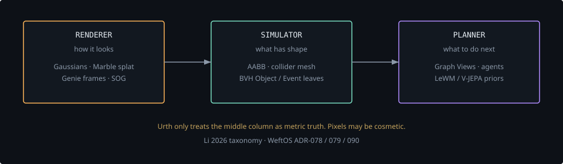
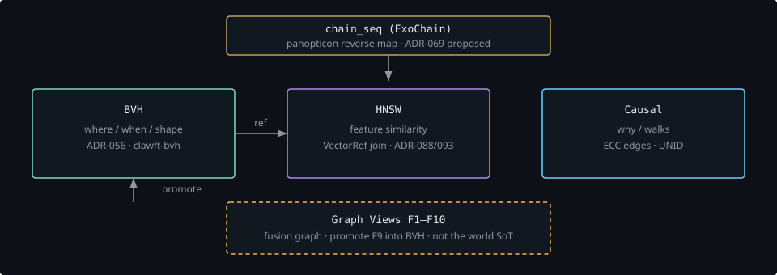
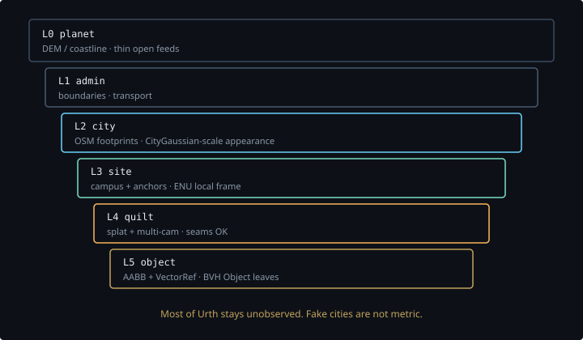
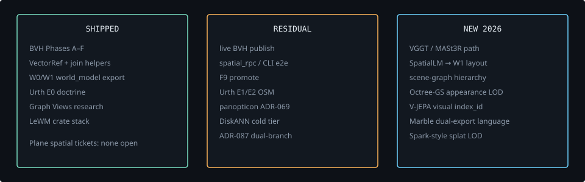

# Scrollyteller storyboard — Urth, indexes, spatial intelligence 2026

**Route:** `/urth-spatial` (Fumadocs custom app, sibling of `/lewm-worldmodel-rs`)  
**Audience:** WeftOS maintainers + cold readers who have heard “world model” in 2026 news  
**Thesis:** WeftOS already has a **metric spatial index** (BVH) and a **feature index** (HNSW). The 2026 “world model” boom is three jobs — renderer, simulator, planner — and Urth only treats generative pixels as truth when they carry geometry + chain.

**Arc:** Deep-dive explainer (hook → problem → where we are → 2026 landscape → directions/queue).  
**Scroll budget:** ~9–11 viewport heights. Sticky titles. One motion per viewport. `prefers-reduced-motion` kills parallax.

**Design tokens:** WeftOS DESIGN.md charcoal + gold accent `#C4A25C`; spatial cyan `#6dd3ff` for geometry; mint for structure; violet for latent/features. Color is semantic.

---

## Scenes

| id | scroll | primary goal | visual | motion |
|---|---|---|---|---|
| S00 | 0–12% | Name Urth and the honesty rule | Sparse globe of islands in a dark ellipsoid | Hero zoom + parallax grid |
| S01 | 12–24% | “World model” now means three jobs | Renderer / simulator / planner stacked planes | Layers peel at different rates |
| S02 | 24–38% | Show the four WeftOS indexes | BVH, HNSW, causal, chain | Sticky left title; SVG stack lights on scroll |
| S03 | 38–50% | Appearance ≠ structure (ADR-078) | Dual split: splat field vs AABB leaves | Horizontal wipe |
| S04 | 50–60% | Join without mixing indexes | VectorRef dashed join | Hover/click tile opens depth |
| S05 | 60–72% | Honest current state | Residuals list vs Done Phases A–F | Timeline; amber for residual |
| S06 | 72–86% | 2026 sources worth stealing | Cards S1–S8 | Staggered cards; click → rail |
| S07 | 86–96% | Directions + research queue | Old residuals + new proposals | Vertical queue, gold on apply |
| S08 | 96–100% | So-what + links | Links to ADRs and deep dives | Quiet closer |

### Not in this page

- LeWM SIGReg manifold (already `/lewm-worldmodel-rs`)
- Sonobuoy K-STEMIT math
- Investor pitch
- Filing Plane tickets live

---

## ASCII (source for SVG)



<details>
<summary>ASCII Version (for AI/accessibility)</summary>

```
  RENDERER                 SIMULATOR                PLANNER
  how it looks             what has shape           what to do next
 ┌──────────────┐         ┌──────────────┐         ┌──────────────┐
 │ Gaussians    │         │ AABB / mesh  │         │ Agents       │
 │ Marble splat │         │ collider     │         │ Graph Views  │
 │ Genie frames │         │ BVH leaves   │         │ LeWM / JEPA  │
 └──────┬───────┘         └──────┬───────┘         └──────┬───────┘
        │                        │                        │
        └──────────── dual export / VectorRef ────────────┘
                         Urth only trusts the middle
                         as metric truth
```

</details>

### Diagram B — WeftOS indexes



<details>
<summary>ASCII Version (for AI/accessibility)</summary>

```
                    chain_seq  (panopticon: proposed)
                           │
        ┌──────────────────┼──────────────────┐
        ▼                  ▼                  ▼
   ┌─────────┐       ┌─────────┐        ┌─────────┐
   │  BVH    │       │  HNSW   │        │ Causal  │
   │ where / │       │ similar │        │  why    │
   │ when /  │  ref  │ feature │        │         │
   │ shape   │──────▶│         │        │         │
   └─────────┘       └─────────┘        └─────────┘
        ▲
        │ promote F9
   Graph Views (fusion, not SoT)
```

</details>

### Diagram C — Urth LOD



<details>
<summary>ASCII Version (for AI/accessibility)</summary>

```
 L0 planet     thin DEM / coastline
 L1 admin      boundaries
 L2 city       OSM footprints          ← CityGaussian-scale appearance
 L3 site       campus + anchors
 L4 quilt      splat + multi-cam       ← live capture
 L5 object     AABB + VectorRef        ← BVH Object leaves
                unobserved is honest
```

</details>

### Diagram D — queue



<details>
<summary>ASCII Version (for AI/accessibility)</summary>

```
 SHIPPED          RESIDUAL            NEW 2026
 A–F BVH          live publish        VGGT / MASt3R path
 VectorRef        spatial_rpc         SpatialLM → W1
 W0/W1 export     F9 promote          scene-graph hierarchy
 Urth E0          Urth E1/E2          Octree-GS appearance LOD
                  panopticon          V-JEPA visual index_id
                  DiskANN defer       Marble language (already our split)
```

</details>

---

## Clickable-tile contract

Every card/tile **opens a second layer** (expand or detail rail). Native `title` is not a tooltip. Try / See / Why on interactive diagrams.

## Billboard test

Sticky section titles on desktop (`lg:sticky lg:top-32`). Mobile stacks. No competing animations. Reduced-motion: static SVG + prose.
